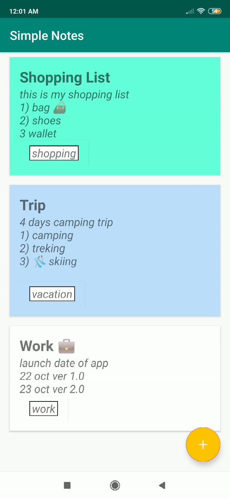

# Introduction

🗒️ Savy Note is a Kotlin based app to manage notes.All Changes in database is pushed to Firebase Realtime Database.App respects its Mvvm architecture. Android Architecture Components
Part of Android Jetpack. Android architecture components are a collection of libraries that help 
you design robust, testable, and maintainable apps. 

<h4>Features</h4>
<ul>
    <li>Google Sign In</li>
  <li>Add Note</li>
   <li>Delete Note</li>
   <li>Edit Note</li>
    <li>Push Changes to Firebase</li>
  </ul>

<h4>Screenshots</h4>
<table>
<thead>
<tr>
<th align="center">Add Notes</th>
<th align="center">Edit Notes</th>
<th align="center">Delete Notes</th>
    <th align="center">Google Sign In</th>
    <th align="center">Firebase Realtime Database</th>
</tr>
</thead>
<tbody>
<tr>
<td> </td>
<td> </td>
<td> </td>
    <td> 
        <td> </td>
    
</tr>
</tbody>
</table>

<h4>Architecture</h4>

MVVM is one of the architectural patterns which enhances separation of concerns, it allows
separating the user interface logic from the business (or the back-end) logic. Its target 
(with other MVC patterns goal) is to achieve the following principle “Keeping UI code simple 
and free of app logic in order to make it easier to manage”.

<ul>
<li>Lifecycles: It manages activity and fragment lifecycles of our app, survives configuration changes,
avoids memory leaks and easily loads data into our UI.</li>
<li>LiveData: It notifies views of any database changes. Use LiveData to build data objects that notify views when
the underlying database changes.</li>
<li>Room: It is a SQLite object mapping library. Use it to Avoid boilerplate code and easily 
convert SQLite table data to Java objects. Room provides compile time checks of SQLite statements
and can return RxJava, Flowable and LiveData observables.</li>
<li>ViewModel: It manages UI-related data in a lifecycle-conscious way. It stores UI-related data
that isn't destroyed on app rotations.</li>
<li>Repository: The repository depends on a persistent data model and a remote backend data source.</li>

 

 <h4>Library used</h4>
<ul>
<li><a href="https://developer.android.com/topic/libraries/architecture/room" target="_blank">Room</a></li>
<li><a href="https://developer.android.com/topic/libraries/architecture/viewmodel" target="_blank">Viewmodel</a></li>
<li><a href="https://developer.android.com/topic/libraries/architecture/livedata">Livedata</a></li>
<li><a href="https://github.com/google/dagger" target="_blank">Dagger2</a></li>
<li><a href="https://github.com/google/dagger" target="_blank">Dagger Android</a></li>
<li><a href="https://developer.android.com/kotlin/coroutines" target="_blank">Coroutines</a></li>
<li><a href="https://material.io/develop/android/docs/getting-started/" target="_blank">Material library</a></li>
<li><a href="https://developer.android.com/guide/navigation/navigation-getting-started" target="_blank">Navigation Component</a></li>
  <li><a href="https://developer.android.com/guide/navigation/navigation-pass-data" target="_blank">Safe Args Plugin</a></li>
  <li><a href="https://developer.android.com/guide/navigation/navigation-getting-started" target="_blank">Navigation Component</a></li>
  <li><a href="https://firebase.google.com/docs/auth/?gclid=CjwKCAiAhc7yBRAdEiwAplGxXxl-B9A4ZbUFSdwERC9l-8m5z4Ln74f8gn0PN7fl0D_Ljw321cBXNhoCDwYQAvD_BwE" target="_blank">Firebase Authentication</a></li>
  <li><a href="https://firebase.google.com/docs/database" target="_blank">Firebase Realtime Database</a></li>
  
  
  
</ul>

